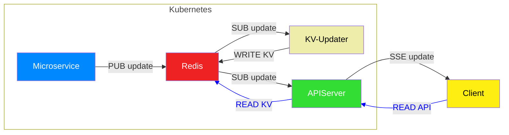

# 🧠 KVUpdater
Step 2 in the Redis-first architecture chain.
This Python service listens to a Redis pub/sub channel, extracts structured data from incoming messages, and persists it to the Redis key-value store.  [Data Architecture Overview](https://github.com/dekeyrej/ecosystem-map/wiki/Data-Architecture-Overview)

## 📦 Overview
KVUpdater is designed to handle real-time updates in a Redis-first system. It subscribes to a Redis pub/sub channel, receives JSON-formatted messages, and stores them in Redis using the type field as the key. Optionally, it can validate that the data was correctly written.

## 🧭 Architecture Diagram


🔄 Flow Summary
- Microservice publishes updates to Redis via pub/sub.
- KV-Updater subscribes to the update channel and persists structured data to Redis KV.
- APIServer listens to the same channel and reads from Redis KV to serve clients.
- Client receives real-time updates via SSE from the APIServer.


## 🔁 Data Flow
Incoming Message Format (via pub/sub)
```json
{
  "type": "key",
  "updated": "2023-10-01T12:00:00Z",
  "valid": "2023-10-01T12:05:32Z",
  "values": {
    "field1": "value1",
    "field2": "value2"
  }
}
```

Stored Format (Redis KV)
```python
key = {
  "updated": "2023-10-01T12:00:00Z",
  "valid": "2023-10-01T12:05:32Z",
  "values": {
    "field1": "value1",
    "field2": "value2"
  }
}
```


## 🚀 Features
- Subscribes to a Redis pub/sub channel
- Parses and validates incoming JSON messages
- Persists structured data to Redis KV store
- Optional post-write validation
- Graceful shutdown on interrupt

## ⚙️ Configuration
Configuration is loaded from a config.py file. Example:
```pyhton
config = {
    "redis_url": "redis://redis.redis:6379/0",
    "channel": "update",
    "validate": True
}
```

## 🧪 Usage
1. Install dependencies
```sh
pip install redis
```


2. Run the service
```sh
python kv_updater.py
```

Make sure your config.py is present in the same directory or adjust the import path accordingly.

## 🛠️ Class Overview
KVUpdater
| Method | Description | 
|---|---|
| __init__ | Initializes Redis client and sets channel and validation flag | 
| persist_data | Parses incoming message and stores it in Redis KV store | 
| run | Subscribes to Redis pub/sub and listens for messages indefinitely | 


## 📓 Logging
- INFO: Service start, validation success, shutdown
- WARNING: Malformed messages
- ERROR: JSON decode failures or Redis errors
- DEBUG: Successful persistence (only visible if logging level is set to DEBUG)

## 🧩 Integration Notes
This service is intended to be used as part of a Redis-first microservice chain. It assumes that upstream services publish structured messages to the configured Redis channel.

## 📚 License
MIT License — feel free to use, modify, and contribute.
